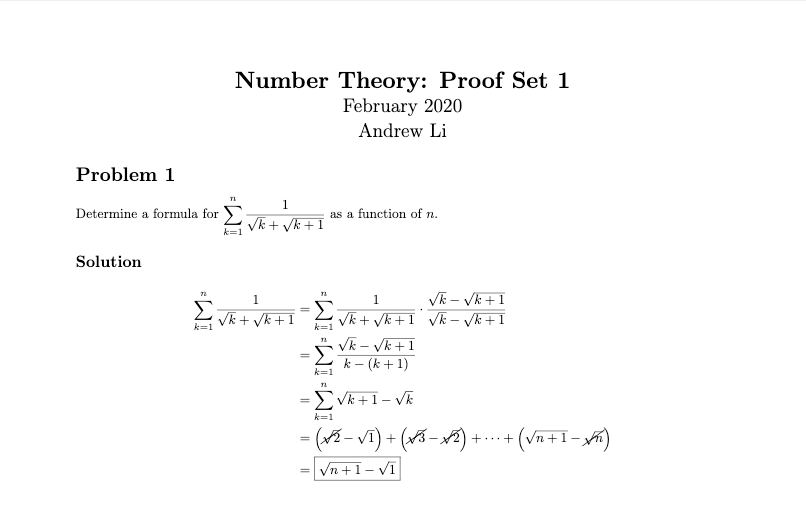

# LaTeX Homework Template

Document class for homework, based on [jdavis' template](https://github.com/jdavis/latex-homework-template). 

```tex
\documentclass{homework}

\course{Number Theory}
\title{Proof Set 1}
\author{Andrew Li}

\begin{document}
  \maketitle

  …
\end{document}
```


